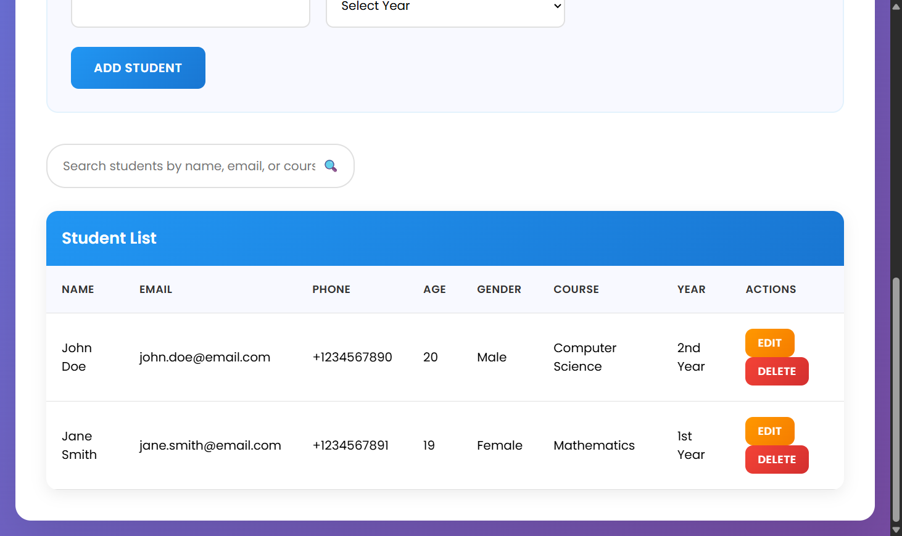

# Student Management System

A beautiful, responsive web application for managing student records with modern UI/UX design and smooth animations.




## 🌟 Features

### Core Functionality
- ✅ **Add New Students** - Complete form with validation
- ✅ **Edit Student Records** - Inline editing with pre-populated data
- ✅ **Delete Students** - Confirmation dialog with smooth animations
- ✅ **Real-time Search** - Search by name, email, or course
- ✅ **Data Persistence** - LocalStorage integration (fallback to memory)

### User Interface
- 🎨 **Modern Design** - Blue and white color palette with gradients
- 📱 **Fully Responsive** - Works on desktop, tablet, and mobile
- ✨ **Smooth Animations** - CSS transitions and keyframe animations
- 🎯 **Interactive Elements** - Hover effects on buttons and cards
- 📊 **Statistics Dashboard** - Real-time student statistics

### Technical Features
- 🚀 **Vanilla JavaScript** - No external dependencies
- 🎭 **CSS Grid & Flexbox** - Modern layout techniques
- 🔤 **Poppins Font** - Clean, professional typography
- ♿ **Accessible** - Proper form labels and semantic HTML
- 🔍 **Search Functionality** - Instant filtering and highlighting

## 🚀 Quick Start

1. **Download the HTML file**
   ```bash
   # Save the HTML file as 'student-management.html'
   ```

2. **Open in browser**
   ```bash
   # Double-click the file or open with your preferred browser
   ```

3. **Start managing students**
   - The system comes with 2 sample students
   - Add, edit, search, and delete students immediately

## 📋 Usage Guide

### Adding Students
1. Fill out the form with student details:
   - First Name & Last Name
   - Email & Phone
   - Age & Gender
   - Course & Year
2. Click "Add Student" button
3. Success message will appear

### Editing Students
1. Click "Edit" button next to any student
2. Form will populate with existing data
3. Modify fields as needed
4. Click "Update Student" to save changes

### Searching Students
1. Use the search box above the student table
2. Search by name, email, or course
3. Results filter in real-time

### Deleting Students
1. Click "Delete" button next to any student
2. Confirm deletion in the dialog
3. Student will be removed with animation

## 🎨 Design System

### Color Palette
- **Primary Blue**: `#2196F3`
- **Dark Blue**: `#1976D2`
- **Light Blue**: `#e3f2fd`
- **Background**: `#f8f9ff`
- **White**: `#ffffff`
- **Gray**: `#666666`

### Typography
- **Font Family**: Poppins (Google Fonts)
- **Weights**: 300, 400, 500, 600, 700
- **Sizes**: 14px - 40px (responsive)

### Animations
- **Fade In/Out**: 0.3s ease
- **Slide Up**: 0.6s ease-out
- **Hover Effects**: 0.3s ease
- **Button Transforms**: translateY(-2px)

## 📱 Responsive Breakpoints

- **Desktop**: 1200px and above
- **Tablet**: 768px - 1199px
- **Mobile**: Below 768px

### Mobile Optimizations
- Single column form layout
- Full-width buttons
- Reduced font sizes
- Optimized table scrolling
- Touch-friendly interactions

## 🔧 Technical Implementation

### File Structure
```
student-management.html
├── HTML Structure
├── CSS Styles (embedded)
└── JavaScript Logic (embedded)
```

### Data Structure
```javascript
Student Object {
  firstName: String,
  lastName: String,
  email: String,
  phone: String,
  age: Number,
  gender: String,
  course: String,
  year: String
}
```

### Key Classes
- `StudentManager` - Main application class
- Event handling for form submission
- Real-time search implementation
- Data persistence management

## 🌐 Browser Compatibility

- ✅ Chrome 60+
- ✅ Firefox 55+
- ✅ Safari 12+
- ✅ Edge 79+
- ✅ Opera 47+

## 📦 Dependencies

### External Resources
- **Google Fonts**: Poppins font family
- **No JavaScript libraries** - Pure vanilla JS

### Browser APIs Used
- LocalStorage (with fallback)
- DOM manipulation
- CSS3 animations
- Form validation

## 🔒 Data Storage

### LocalStorage Implementation
```javascript
// Data is automatically saved to localStorage
// Persists between browser sessions
// Fallback to memory storage if unavailable
```

### Data Security
- Client-side storage only
- No server communication
- No sensitive data encryption needed
- Form validation prevents invalid entries

## 🎯 Performance Features

- **Lazy Loading**: Animations triggered on demand
- **Efficient DOM Updates**: Minimal redraws
- **Debounced Search**: Optimized search performance
- **CSS Transitions**: Hardware-accelerated animations
- **Minimal Bundle Size**: Single HTML file

## 🚀 Deployment Options

### Option 1: Static Hosting
- Upload to any static hosting service
- GitHub Pages, Netlify, Vercel
- No server setup required

### Option 2: Local Usage
- Save as HTML file
- Open directly in browser
- Works offline

### Option 3: Integration
- Embed in existing websites
- Customize styles to match brand
- Extract components as needed

## 🔧 Customization

### Styling
```css
/* Modify CSS variables for easy theming */
:root {
  --primary-color: #2196F3;
  --secondary-color: #1976D2;
  --background-color: #f8f9ff;
}
```

### Form Fields
```javascript
// Add new fields to the form structure
// Update the Student object model
// Modify the table columns accordingly
```

### Validation Rules
```javascript
// Customize validation in handleSubmit method
// Add new validation rules as needed
// Modify error messages
```

## 🐛 Known Issues & Solutions

### Issue: LocalStorage Not Available
**Solution**: System automatically falls back to memory storage

### Issue: Mobile Keyboard Overlap
**Solution**: Viewport meta tag and CSS viewport units handle this

### Issue: Old Browser Support
**Solution**: Graceful degradation with CSS fallbacks

## 🤝 Contributing

1. Fork the project
2. Create your feature branch
3. Commit your changes
4. Push to the branch
5. Open a Pull Request

## 🙏 Acknowledgments

- **Google Fonts** - Poppins typography
- **CSS Grid & Flexbox** - Modern layout techniques
- **Vanilla JavaScript** - Pure web technologies

## 📞 Support

For support, please create an issue in the repository or contact the development team.

---

## 👨‍💻 Author

**GitHub**: [Chennuru Swarup](https://github.com/swarup79997/)  
**Email**: swarup8125@gmail.com

**Built with ❤️ using Vanilla JavaScript, CSS3, and HTML5**
